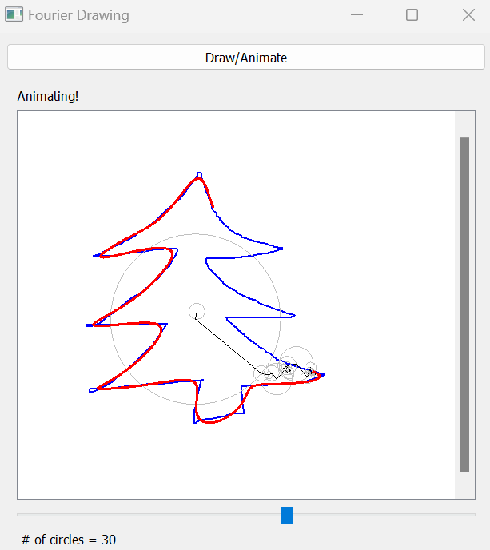

# Fourier Drawing

The Fourier Drawing App leverages the Fourier series to parameterize a sequence of connected rotating vectors to draw a line image. By calculating and setting the length and initial rotation angle of each vector, we can make the end effector approximate any target drawing.

The animation consists of a target line image drawn by the user, the sequence of connected vectors as they rotate through space, and the final Fourier drawing traced out by the end point of the vectors.

## Instructions

- Run main.py to open the app GUI.
- Draw a line image and click animate to see the Fourier drawing animation.
- Use the slider to control the number of circles / terms of the Fourier series to use.

## Example

## Inspiration
[Video by 3Blue1Brown](https://www.youtube.com/shorts/qmNtSq2e5eM)